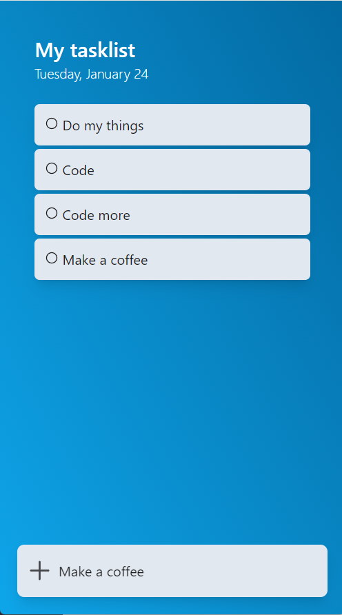

# YATLA - Yet Another Todo-List App

YATLA is a simple yet stylish todo-list app built using HTML, Tailwind CSS, and vanilla JavaScript. It provides a minimalistic user interface inspired by Microsoft To-Do and is designed as a learning project with no copyright intended.

## Features
- Add tasks to your list with ease
- Delete tasks when they are completed or no longer needed
- Clean and responsive design

## Usage

- Open the app by loading the `index.html` file in your web browser.
- Start adding tasks using the input field at the bottom.
- Click on the "+" button or press Enter to add a new task.
- Each task will be displayed with a checkbox icon for completion.
- Click on the checkbox icon to delete a task when it's completed or no longer needed.

## Preview

## Contributing

Feel free to contribute to the project by opening issues or submitting pull requests. Any suggestions or improvements are welcome.

## Acknowledgements

- [Tailwind CSS](https://tailwindcss.com/) - A utility-first CSS framework.
- [Ionicons](https://ionicons.com/) - Beautifully crafted icons.

## License

This project is licensed under the MIT License - see the [LICENSE](LICENSE) file for details.

---

**Note:** Design inspired by Microsoft To-Do. This is a learning project, and no copyright infringement is intended.
